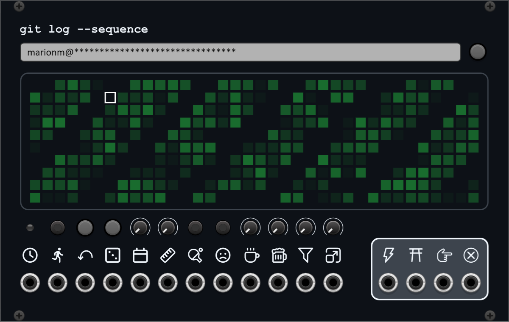

# WIP VCV Rack plugin

## Manuals

### Seqhub

A sequencer based on Github user's contribution activity.

#### Token

You must provide the sequencer with a Github personal access token so that it can access the Github GraphQL API.

The token is *not* saved with patches, but the loaded activity is, so you don't need to re-enter your token every time.

For private activity, use a classic token with the `repo` and `read:user` permissions.

#### Username

Username is optional - by default, contribution activity is loaded for the token's owner.

## Development

### Setup

1. `git submodule init`
2. `make && make install`
