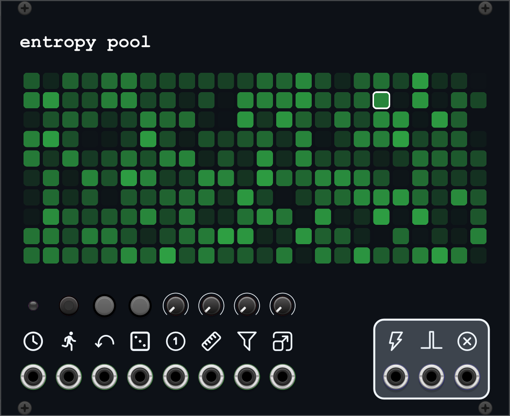

# sporkbomb VCV Rack plugin

## Entropy Pool

A sequencer that slices from a pool of random data

### Github integration

The context menu includes an "Integrations..." item, which lets you use a Github token to use a
user's contribution history (the green boxes on their profile page) as the data source.

To load private activity, use a classic token with the `repo` and `read:user` permissions.

The token is *not* saved with patches, but the loaded activity is, so you don't need to re-enter your token every time.

# Development

## Setup

1. Download the Rack SDK to `../Rack-SDK`
  * Or, download anywhere and set the `RACK_DIR` environment variable to its path
2. `make && make install`

## TODO

* input/output modal with raw values string (comma separated)
* value tooltips on mouse hover in grid?
* Can i support click/drag or right click modal editing *per* cell?
* Another SVG pass
    * color scheme - still dev centric, but more terminal or vim than github?
        * some vim schemes are nice...
    * background texture? pure flat is typical, but maybe improvable
    * border? (like raw textured metal?)
    * custom knob svgs?
    * custom screw svgs?
* Github build for all platforms
* Upgrade to C++... 17? 20? What is safe w/VCVrack publishing?
* vcv manual? how do those work?
* Standardize spacing before publishing, so new modules can be consistent
    * Is 11mm horizontal good?
        * What does default vcv do?
    * What about vertical from port to label? Port to cv knob? Label to cv knob? Or regular knobs?
* better plugin/author name
* Update readme with more info
* Publish!
